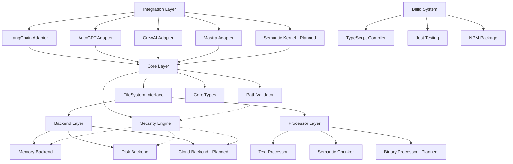
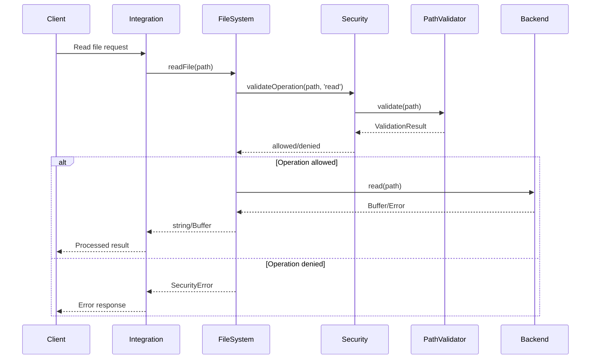
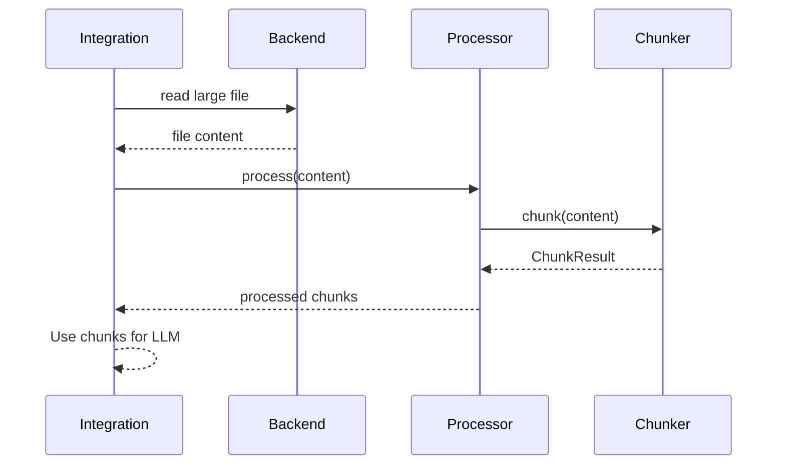
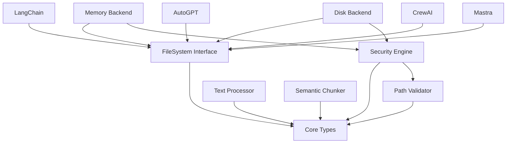

# Component Map

## Purpose
This document provides a map of all components in the PackFS system, their relationships, and responsibilities.

## Classification
- **Domain:** Architecture
- **Stability:** Semi-stable
- **Abstraction:** Structural
- **Confidence:** Established

## Content

### Component Overview

The PackFS system is composed of the following major components and their relationships:

### Component Inventory

| Component | Type | Purpose | Key Responsibilities |
|-----------|------|---------|---------------------|
| FileSystem Interface | Core/Abstract | Abstract base class for filesystem operations | Define standard filesystem operations, enforce contracts |
| Security Engine | Core/Security | Validate and secure file operations | Path validation, permission checks, extension filtering |
| Path Validator | Core/Utility | Normalize and validate file paths | Prevent path traversal, sandbox enforcement |
| Memory Backend | Backend/Storage | In-memory file storage | Testing, caching, temporary storage |
| Disk Backend | Backend/Storage | Local filesystem storage | Persistent file storage with safety controls |
| Text Processor | Processor/Content | Process text files | Normalize text content, handle encodings |
| Semantic Chunker | Processor/Content | Split large files semantically | Intelligent text chunking for LLM context windows |
| LangChain Adapter | Integration/Framework | LangChain tool integration | Provide filesystem tools for LangChain agents |
| AutoGPT Adapter | Integration/Framework | AutoGPT plugin integration | Provide filesystem plugin for AutoGPT |
| CrewAI Adapter | Integration/Framework | CrewAI tool integration | Provide filesystem tools for CrewAI agents |
| Mastra Adapter | Integration/Framework | Mastra tool integration | Native tool factory for Mastra agents with intent-based API |

### Component Details

#### FileSystem Interface

**Purpose**: Abstract base class that defines the contract for all filesystem operations in PackFS

**Responsibilities**:
- Define standard filesystem operations (read, write, exists, stat, etc.)
- Enforce consistent API across all backends
- Provide extension points for backend implementations

**Dependencies**:
- **Depends on**: Core Types
- **Used by**: All backends, all integrations

**Key Interfaces**:
- `readFile()`: Read file contents with options
- `writeFile()`: Write file contents with options
- `exists()`: Check file existence
- `stat()`: Get file metadata
- `readdir()`: List directory contents
- `mkdir()`: Create directories
- `remove()`: Delete files/directories
- `copy()`: Copy files/directories
- `move()`: Move/rename files/directories

**Implementation**: `/workspace/code/src/core/filesystem.ts`

#### Security Engine

**Purpose**: Centralized security validation for all filesystem operations

**Responsibilities**:
- Validate file operations against security policies
- Check file extensions against allowlist
- Validate file sizes
- Enforce path restrictions

**Dependencies**:
- **Depends on**: Core Types
- **Used by**: All filesystem operations

**Key Interfaces**:
- `validateOperation()`: Check if operation is allowed
- `isAllowedExtension()`: Validate file extensions
- `isValidFileSize()`: Check file size limits

**Implementation**: `/workspace/code/src/core/security.ts`

#### Path Validator

**Purpose**: Normalize and validate file paths to prevent security vulnerabilities

**Responsibilities**:
- Normalize file paths
- Detect and prevent path traversal attempts
- Enforce sandbox boundaries
- Validate path format

**Dependencies**:
- **Depends on**: Node.js path module
- **Used by**: Security Engine, all backends

**Key Interfaces**:
- `validate()`: Validate and normalize a path
- `isInSandbox()`: Check if path is within sandbox

**Implementation**: `/workspace/code/src/core/path-validator.ts`

#### Memory Backend

**Purpose**: In-memory storage backend for testing and caching

**Responsibilities**:
- Store files in memory using Map data structure
- Implement full filesystem interface
- Support testing scenarios
- Enable fast caching layer

**Dependencies**:
- **Depends on**: FileSystem Interface, Core Types
- **Used by**: Tests, caching scenarios

**Key Features**:
- No persistence
- Fast operations
- Isolated storage
- Perfect for testing

**Implementation**: `/workspace/code/src/backends/memory.ts`

#### Disk Backend

**Purpose**: Local filesystem storage with safety controls

**Responsibilities**:
- Implement filesystem operations using Node.js fs module
- Enforce sandboxing through base path restrictions
- Handle filesystem errors gracefully
- Provide persistent storage

**Dependencies**:
- **Depends on**: FileSystem Interface, Core Types, Node.js fs
- **Used by**: Production deployments

**Key Features**:
- Persistent storage
- Sandbox support
- Error handling
- Production ready

**Implementation**: `/workspace/code/src/backends/disk.ts`

#### Semantic Chunker

**Purpose**: Intelligently split large text files for LLM processing

**Responsibilities**:
- Split text by semantic boundaries (paragraphs, sentences)
- Maintain context with overlapping chunks
- Handle various text sizes efficiently
- Provide metadata about chunking results

**Dependencies**:
- **Depends on**: Processor Types
- **Used by**: Framework integrations, text processing pipelines

**Key Features**:
- Configurable chunk size
- Overlap support
- Semantic awareness
- Performance optimized

**Implementation**: `/workspace/code/src/processors/chunker.ts`

#### Mastra Adapter

**Purpose**: Native integration with the Mastra agent framework through tool factories and intent-based API

**Responsibilities**:
- Provide `createPackfsTools()` function for generating ready-to-use Mastra tools
- Implement intent-based API (AccessIntent, DiscoverIntent, UpdateIntent)
- Integrate with PackFS security system automatically
- Support permission-based tool generation
- Provide pre-built Zod schemas for all operations
- Handle semantic content processing for structured documents

**Dependencies**:
- **Depends on**: FileSystem Interface, Core Types, Security Engine, Zod schemas
- **Used by**: Mastra-based agent implementations

**Key Features**:
- Native Mastra tool factory
- Intent-based operations API
- Built-in security validation  
- Pre-built Zod schemas
- Configurable permissions
- Semantic search capabilities
- Document relationship mapping
- 90% reduction in integration boilerplate

**Key Interfaces**:
- `createPackfsTools()`: Generate permission-based Mastra tools
- `AccessIntent`: Structured read operations
- `DiscoverIntent`: Search and list operations  
- `UpdateIntent`: Write and modification operations
- `PackfsToolConfig`: Configuration interface
- `MastraSecurityValidator`: Security validation for tools

**Implementation**: `/workspace/code/src/integrations/mastra/`

### Component Interaction Patterns

#### File Read Operation

#### Content Processing Flow

### Component Dependencies

### Component Boundaries and Interfaces

**Core Layer Boundary**: 
- Defines all contracts and types
- No external dependencies except Node.js built-ins
- Pure TypeScript interfaces and classes

**Backend Layer Boundary**:
- Implements FileSystem Interface
- Can have external dependencies (fs, cloud SDKs)
- Isolated from framework specifics

**Processor Layer Boundary**:
- Content-specific processing logic
- Independent of storage backends
- Reusable across integrations

**Integration Layer Boundary**:
- Framework-specific adapters
- Depends on core layer only
- Translates between PackFS and framework APIs

### Component Evolution

**Recent Additions**:
1. **Mastra Adapter**: Native tool factory integration with intent-based API (ADR-004)

**Planned Additions**:
1. **Cloud Backend**: AWS S3, Azure Blob, Google Cloud Storage support
2. **Binary Processor**: Apache Tika integration for 1000+ file formats
3. **Semantic Kernel Adapter**: Microsoft Semantic Kernel integration
4. **Caching Layer**: Three-tier caching system
5. **Virtual Filesystem**: Complete filesystem virtualization

**Refactoring Plans**:
1. Extract common backend logic to base class
2. Add streaming support for large files
3. Implement async iteration for directory listings
4. Add transaction support for atomic operations

## Relationships
- **Parent Nodes:** None (top-level architecture document)
- **Child Nodes:** 
  - Individual component implementation files in `/workspace/code/src/`
- **Related Nodes:** 
  - [foundation/system_overview.md] - summarizes - High-level system overview
  - [decisions/adr_001_typescript_npm_package_setup_for_mastra_compatibility.md] - guides - Implementation decisions

## Navigation Guidance
- **Access Context:** Use this document when needing to understand the components that make up PackFS and their relationships
- **Common Next Steps:** After reviewing this component map, explore specific component implementations or integration examples
- **Related Tasks:** System design, component development, integration planning
- **Update Patterns:** This document should be updated when components are added, removed, or their responsibilities change significantly

## Metadata
- **Created:** Initial architecture design
- **Last Updated:** 2024-06-19
- **Updated By:** Implementation team

## Change History
- Initial: Created component map template
- 2024-01-18: Updated with implemented PackFS architecture and components
- 2024-06-19: Added Mastra Adapter component based on user feedback integration