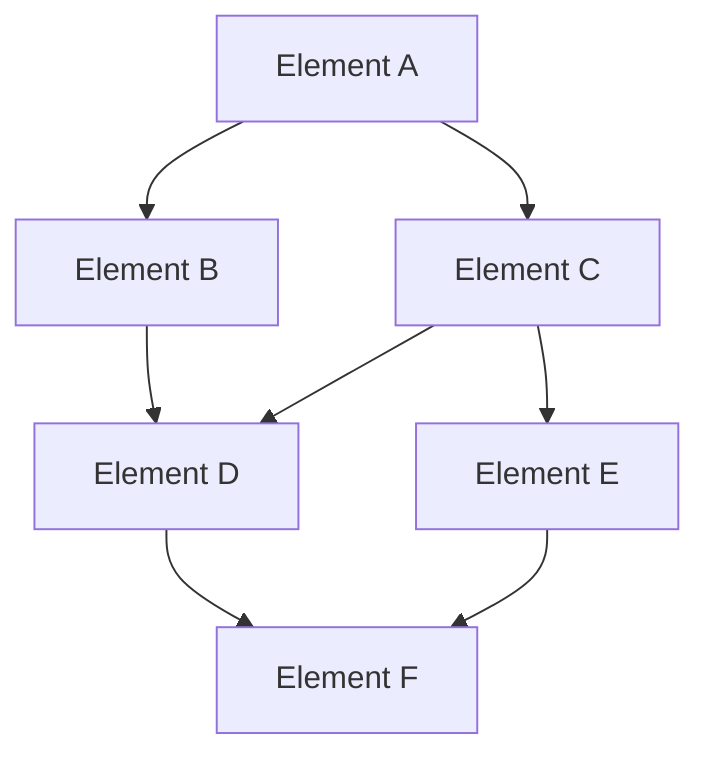

# Element Dependencies

## Purpose
This document maps the dependencies between different elements of the project, helping to understand how changes in one element might impact others.

## Classification
- **Domain:** Structure
- **Stability:** Semi-stable
- **Abstraction:** Structural
- **Confidence:** Established

## Content

### Dependency Overview

[Provide a high-level overview of the dependencies between project elements]

### Critical Dependencies

[List and describe the most critical dependencies in the project]

#### [Element A] → [Element B]
- **Dependency Type:** [Type of dependency]
- **Description:** [Description of how Element A depends on Element B]
- **Impact of Changes:** [Description of how changes in Element B might impact Element A]
- **Stability:** [Assessment of the stability of this dependency]

#### [Element B] → [Element D]
- **Dependency Type:** [Type of dependency]
- **Description:** [Description of how Element B depends on Element D]
- **Impact of Changes:** [Description of how changes in Element D might impact Element B]
- **Stability:** [Assessment of the stability of this dependency]

#### [Element C] → [Element D]
- **Dependency Type:** [Type of dependency]
- **Description:** [Description of how Element C depends on Element D]
- **Impact of Changes:** [Description of how changes in Element D might impact Element C]
- **Stability:** [Assessment of the stability of this dependency]

### Dependency Types

[Describe the different types of dependencies that exist in the project]

#### Data Dependencies
[Description of data dependencies]

#### Functional Dependencies
[Description of functional dependencies]

#### Sequential Dependencies
[Description of sequential dependencies]

#### Resource Dependencies
[Description of resource dependencies]

### Dependency Management

[Describe the approach to managing dependencies in the project]

#### Dependency Analysis
[Description of how dependencies are analyzed]

#### Dependency Documentation
[Description of how dependencies are documented]

#### Dependency Validation
[Description of how dependencies are validated]

#### Dependency Change Management
[Description of how changes to dependencies are managed]

### Dependency Risks

[Describe the risks associated with dependencies in the project]

#### High-Risk Dependencies
[List and describe high-risk dependencies]

#### Dependency Risk Mitigation
[Describe strategies for mitigating dependency risks]

### Dependency Metrics

[Describe metrics used to measure and monitor dependencies]

#### Dependency Count
[Description of dependency count metrics]

#### Dependency Stability
[Description of dependency stability metrics]

#### Dependency Cycle Detection
[Description of dependency cycle detection metrics]

## Relationships
- **Parent Nodes:** [foundation/structure.md]
- **Child Nodes:** None
- **Related Nodes:** 
  - [connections/interfaces.md] - details - Interfaces between elements
  - [elements/*] - depends-on - Elements with dependencies

## Navigation Guidance
- **Access Context:** Use this document when analyzing the impact of changes or understanding project structure
- **Common Next Steps:** After reviewing dependencies, typically explore specific elements or interfaces
- **Related Tasks:** Impact analysis, change planning, architecture review
- **Update Patterns:** This document should be updated when new dependencies are introduced or existing ones change

## Metadata
- **Created:** 5/16/2025
- **Last Updated:** 5/16/2025
- **Updated By:** Context Network Update

## Change History
- 5/16/2025: Created from cross-domain/dependencies.md with more generic terminology
