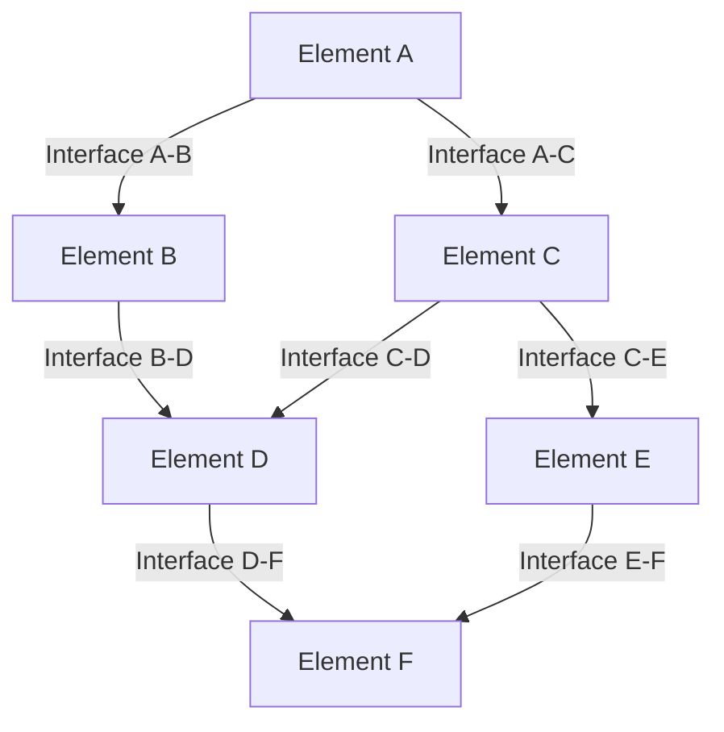

# Element Interfaces

## Purpose
This document defines the interfaces between different elements of the project, specifying how they interact and exchange information.

## Classification
- **Domain:** Structure
- **Stability:** Semi-stable
- **Abstraction:** Structural
- **Confidence:** Established

## Content

### Interface Overview

[Provide a high-level overview of the interfaces between project elements]

### Key Interfaces

[List and describe the most important interfaces in the project]

#### Interface A-B: [Element A] ↔ [Element B]

**Purpose:**
[Describe the purpose of this interface]

**Interface Type:**
[Describe the type of interface (e.g., data exchange, control flow, etc.)]

**Exchange Format:**
[Describe the format of information exchanged through this interface]

**Responsibilities:**
- [Element A]: [Responsibilities of Element A in this interface]
- [Element B]: [Responsibilities of Element B in this interface]

**Interface Contract:**
[Describe the contract or agreement that governs this interface]

**Stability:**
[Assessment of the stability of this interface]

#### Interface B-D: [Element B] ↔ [Element D]

**Purpose:**
[Describe the purpose of this interface]

**Interface Type:**
[Describe the type of interface (e.g., data exchange, control flow, etc.)]

**Exchange Format:**
[Describe the format of information exchanged through this interface]

**Responsibilities:**
- [Element B]: [Responsibilities of Element B in this interface]
- [Element D]: [Responsibilities of Element D in this interface]

**Interface Contract:**
[Describe the contract or agreement that governs this interface]

**Stability:**
[Assessment of the stability of this interface]

#### Interface C-D: [Element C] ↔ [Element D]

**Purpose:**
[Describe the purpose of this interface]

**Interface Type:**
[Describe the type of interface (e.g., data exchange, control flow, etc.)]

**Exchange Format:**
[Describe the format of information exchanged through this interface]

**Responsibilities:**
- [Element C]: [Responsibilities of Element C in this interface]
- [Element D]: [Responsibilities of Element D in this interface]

**Interface Contract:**
[Describe the contract or agreement that governs this interface]

**Stability:**
[Assessment of the stability of this interface]

### Interface Types

[Describe the different types of interfaces that exist in the project]

#### Data Exchange Interfaces
[Description of data exchange interfaces]

#### Control Flow Interfaces
[Description of control flow interfaces]

#### Event-Based Interfaces
[Description of event-based interfaces]

#### Resource Sharing Interfaces
[Description of resource sharing interfaces]

### Interface Management

[Describe the approach to managing interfaces in the project]

#### Interface Definition
[Description of how interfaces are defined]

#### Interface Documentation
[Description of how interfaces are documented]

#### Interface Validation
[Description of how interfaces are validated]

#### Interface Change Management
[Description of how changes to interfaces are managed]

### Interface Versioning

[Describe the approach to versioning interfaces in the project]

#### Version Compatibility
[Description of version compatibility requirements]

#### Deprecation Process
[Description of the process for deprecating interfaces]

#### Migration Strategies
[Description of strategies for migrating between interface versions]

### Interface Monitoring

[Describe how interfaces are monitored in the project]

#### Health Metrics
[Description of interface health metrics]

#### Performance Metrics
[Description of interface performance metrics]

#### Usage Metrics
[Description of interface usage metrics]

## Relationships
- **Parent Nodes:** [foundation/structure.md]
- **Child Nodes:** None
- **Related Nodes:** 
  - [connections/dependencies.md] - relates-to - Dependencies between elements
  - [elements/*] - interfaces-with - Elements with interfaces

## Navigation Guidance
- **Access Context:** Use this document when designing interactions between elements or troubleshooting integration issues
- **Common Next Steps:** After reviewing interfaces, typically explore specific elements or dependencies
- **Related Tasks:** Interface design, integration planning, compatibility analysis
- **Update Patterns:** This document should be updated when new interfaces are introduced or existing ones change

## Metadata
- **Created:** 5/16/2025
- **Last Updated:** 5/16/2025
- **Updated By:** Context Network Update

## Change History
- 5/16/2025: Created from cross-domain/interfaces.md with more generic terminology
