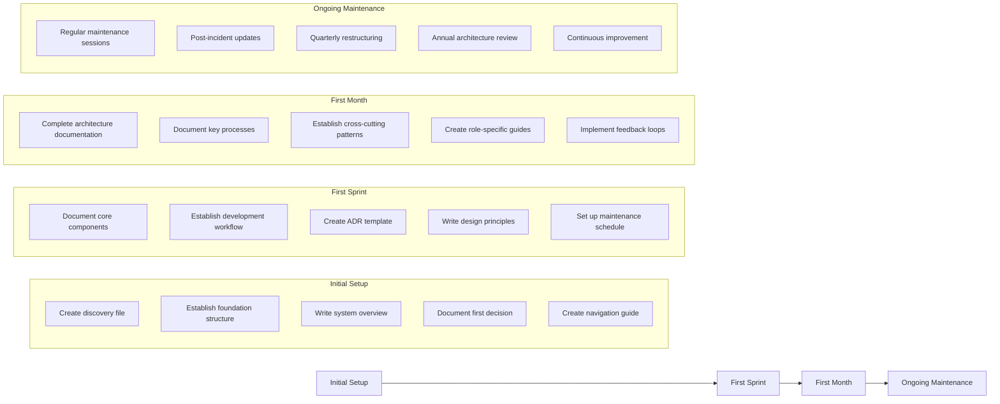

# Software Project Context Network Structure

## Purpose
This document provides an overview of the Software Project Context Network structure, including key elements, their relationships, and the principles guiding their design.

## Classification
- **Domain:** Structure
- **Stability:** Semi-stable
- **Abstraction:** Structural
- **Confidence:** Established

## Content

### Structure Overview

The Software Project Context Network is organized into a hierarchical structure that separates different types of knowledge artifacts while maintaining clear relationships between them. The structure is designed to support the unique knowledge management needs of software development projects.

```mermaid
flowchart TD
    Discovery[discovery.md] --> Foundation[Foundation Layer]
    Discovery --> Architecture[Architecture Layer]
    Discovery --> Decisions[Decision Layer]
    Discovery --> Processes[Process Layer]
    Discovery --> Evolution[Evolution Layer]
    Discovery --> CrossCutting[Cross-Cutting Layer]
    
    Foundation --> SystemOverview[System Overview]
    Foundation --> CoreConcepts[Core Concepts]
    Foundation --> DesignPrinciples[Design Principles]
    Foundation --> TechnologyRadar[Technology Radar]
    
    Architecture --> SystemArch[System Architecture]
    Architecture --> ComponentMap[Component Map]
    Architecture --> DataArch[Data Architecture]
    Architecture --> SecurityArch[Security Architecture]
    
    Decisions --> DecisionLog[Decision Log]
    Decisions --> ADRs[Architecture Decision Records]
    
    Processes --> DevWorkflow[Development Workflow]
    Processes --> TestStrategy[Testing Strategy]
    Processes --> ReleaseProcess[Release Process]
    
    Evolution --> RefactoringPlans[Refactoring Plans]
    Evolution --> TechnicalDebt[Technical Debt Registry]
    
    CrossCutting --> ErrorHandling[Error Handling]
    CrossCutting --> Logging[Logging & Observability]
    CrossCutting --> APIDesign[API Design Guide]
```

### Key Elements

#### Foundation Layer
The Foundation Layer provides the core conceptual framework for the software project. It includes the system overview, core domain concepts, design principles, and technology choices. This layer answers "what is this system and why does it exist?"

#### Architecture Layer
The Architecture Layer documents the structural design of the software system. It includes system architecture, component relationships, data flows, integration patterns, deployment architecture, and security boundaries. This layer answers "how is the system structured?"

#### Decision Layer
The Decision Layer captures the history of important technical decisions. It includes a decision log and individual Architecture Decision Records (ADRs) that document the context, options considered, and rationale for key technical choices. This layer answers "why did we build it this way?"

#### Process Layer
The Process Layer documents how the team works with the software. It includes development workflows, testing strategies, release processes, incident response procedures, and knowledge transfer approaches. This layer answers "how do we work with this system?"

#### Evolution Layer
The Evolution Layer tracks how the system changes over time. It includes refactoring plans, technical debt registry, migration strategies, and deprecation timelines. This layer answers "how is the system changing?"

#### Cross-Cutting Layer
The Cross-Cutting Layer documents concerns that span multiple components. It includes error handling strategies, logging and observability approaches, performance patterns, API design guidelines, and naming conventions. This layer answers "what patterns apply across the system?"

### Element Interactions

The elements in the Software Project Context Network interact through explicit relationships:

1. **Hierarchical Relationships**: Elements are organized in a hierarchy from conceptual (Foundation) to concrete (Implementation).

2. **Traceability Relationships**: Decisions are linked to the architecture components they affect, and architecture components reference the decisions that shaped them.

3. **Temporal Relationships**: Evolution documents track changes to other elements over time, creating a historical record.

4. **Cross-Cutting Relationships**: Patterns and standards in the Cross-Cutting layer apply to multiple elements across other layers.

5. **Process-Artifact Relationships**: Process documents describe how to work with and modify other elements in the network.

### Tools and Methods

| Area | Tools/Methods | Justification |
|-------|--------------|---------------|
| Documentation | Markdown with Mermaid diagrams | Text-based format for version control compatibility, with embedded diagrams for clarity |
| Navigation | Index files and explicit relationships | Enables both hierarchical and associative navigation patterns |
| Decision Records | Architecture Decision Records (ADRs) | Structured format captures context, options, and rationale |
| Component Documentation | Component documentation pattern | Standardized format ensures consistent documentation |
| Process Documentation | Process documentation pattern | Captures triggers, steps, outcomes, and common issues |
| Technical Debt | Technical debt registry | Tracks known compromises with impact assessment and remediation plans |
| LLM Integration | Context-aware prompts and navigation guides | Enables effective AI assistance in maintaining and navigating the network |

### Success Criteria

#### Quality
The structure supports quality by making design intentions explicit, documenting standards, and providing clear patterns for implementation. It enables quality reviews by providing reference documentation for what "good" looks like.

#### Scalability
The hierarchical organization with index files and explicit relationships allows the context network to scale with project size. Information can be progressively disclosed from high-level overviews to detailed specifications.

#### Security
Security architecture is explicitly documented, with security decisions including threat models and risk assessments. Security considerations are traceable through the context network.

#### Reliability
Reliability requirements are documented, with error handling strategies and incident response procedures clearly defined. The structure supports post-incident learning through updates to relevant documentation.

#### Maintainability
The separation of concerns between different types of documentation improves maintainability. The structure supports evolution through explicit tracking of technical debt and refactoring plans.

### Implementation Approach

The Software Project Context Network is implemented through a phased approach:

### Future Evolution

The Software Project Context Network structure is expected to evolve in these ways:

1. **Integration with Code**: Stronger bidirectional links between documentation and code, potentially through automated tooling.

2. **Visualization Improvements**: Enhanced diagrams and visualizations to represent complex relationships.

3. **Automated Validation**: Tools to verify the consistency and completeness of the context network.

4. **Enhanced AI Capabilities**: More sophisticated LLM integration for maintaining and navigating the network.

5. **Metrics and Analytics**: Tools to measure the health and usage of the context network.

6. **Collaboration Enhancements**: Better support for multi-user editing and review workflows.

## Relationships
- **Parent Nodes:** [foundation/project_definition.md]
- **Child Nodes:** 
  - [elements/*/structure.md] - details - Element-specific structural details
  - [decisions/*] - justifies - Key decisions that shaped this structure
- **Related Nodes:** 
  - [foundation/principles.md] - guides - Principles that guided structural decisions
  - [connections/dependencies.md] - details - Dependencies between elements
  - [connections/interfaces.md] - specifies - Interfaces between elements

## Navigation Guidance
- **Access Context:** Use this document when needing to understand the overall project structure and design
- **Common Next Steps:** After reviewing this structure, typically explore specific element structures or decision records
- **Related Tasks:** Project design, element development, integration planning
- **Update Patterns:** This document should be updated when there are significant changes to the project structure or methodology

## Metadata
- **Created:** [Date]
- **Last Updated:** [Date]
- **Updated By:** [Role/Agent]

## Change History
- [Date]: Initial creation of structure document
