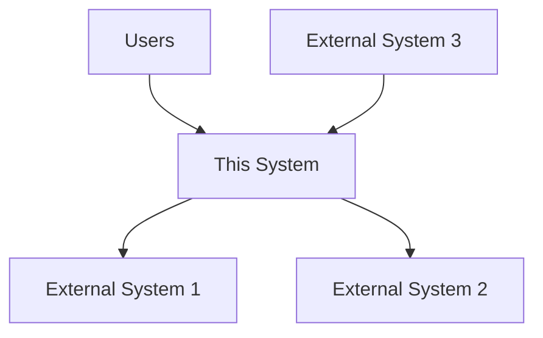
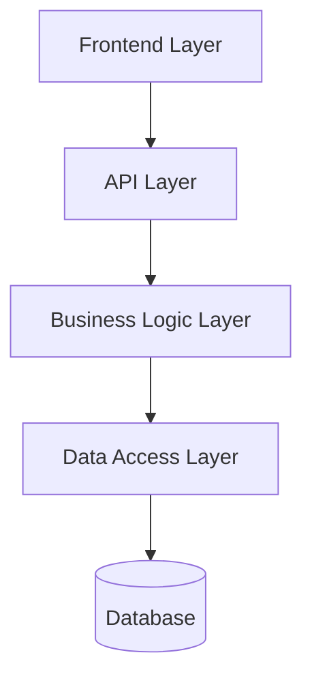
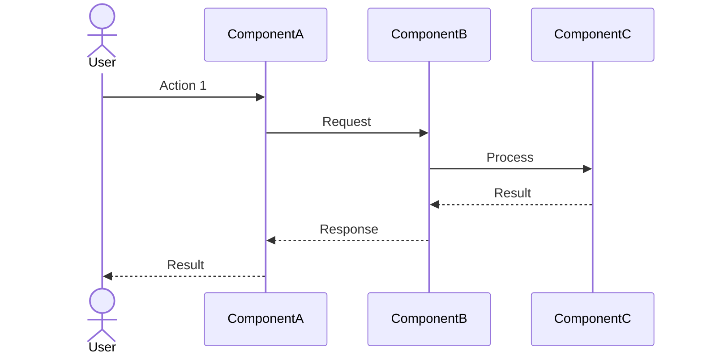
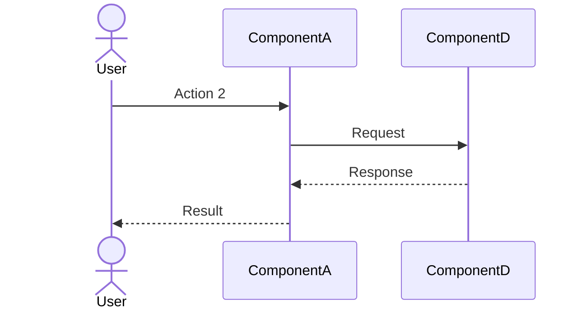
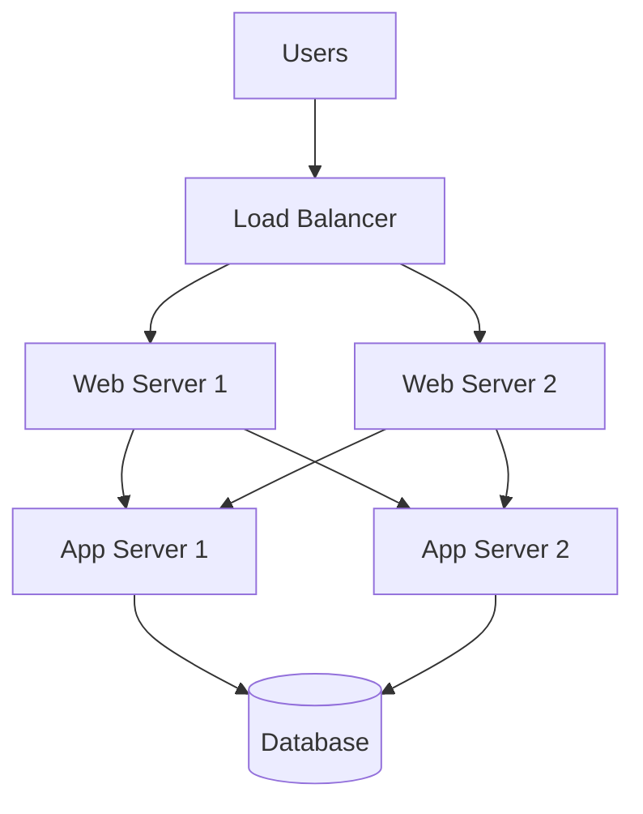

# System Overview

## Purpose
This document provides a high-level overview of the software system, its purpose, key components, and how they work together.

## Classification
- **Domain:** Foundation
- **Stability:** Semi-stable
- **Abstraction:** Conceptual
- **Confidence:** Established

## Content

### System Purpose and Vision

[Describe the fundamental purpose of the system and the vision it fulfills. What problem does it solve? Who are its users? What value does it provide?]

### System Context

[Describe how the system fits into its broader environment, including external systems it interacts with, users, and other stakeholders.]

### Key Capabilities

[List and briefly describe the key capabilities the system provides]

1. **[Capability 1]**
   [Brief description of this capability]

2. **[Capability 2]**
   [Brief description of this capability]

3. **[Capability 3]**
   [Brief description of this capability]

4. **[Capability 4]**
   [Brief description of this capability]

### High-Level Architecture

[Provide a high-level view of the system's architecture, focusing on major components and their relationships]

#### Key Components

[List and briefly describe the key components of the system]

1. **[Component 1]**
   [Brief description of this component's purpose and responsibilities]

2. **[Component 2]**
   [Brief description of this component's purpose and responsibilities]

3. **[Component 3]**
   [Brief description of this component's purpose and responsibilities]

4. **[Component 4]**
   [Brief description of this component's purpose and responsibilities]

### Key Workflows

[Describe the main workflows or user journeys through the system]

#### [Workflow 1]

[Brief description of this workflow]

#### [Workflow 2]

[Brief description of this workflow]

### Technology Stack

[Provide an overview of the key technologies used in the system]

| Layer | Technologies | Justification |
|-------|--------------|---------------|
| Frontend | [Technologies] | [Justification] |
| API | [Technologies] | [Justification] |
| Business Logic | [Technologies] | [Justification] |
| Data Access | [Technologies] | [Justification] |
| Database | [Technologies] | [Justification] |
| Infrastructure | [Technologies] | [Justification] |

### Deployment Model

[Describe how the system is deployed]

### Quality Attributes

[Describe the key quality attributes of the system]

#### Performance
[Performance characteristics and requirements]

#### Scalability
[Scalability approach and limits]

#### Security
[Security approach and key considerations]

#### Reliability
[Reliability approach and expectations]

#### Maintainability
[Maintainability approach and considerations]

### Future Evolution

[Describe how the system is expected to evolve over time]

## Relationships
- **Parent Nodes:** [foundation/project_definition.md]
- **Child Nodes:** 
  - [architecture/system_architecture.md] - details - Detailed system architecture
  - [architecture/component_map.md] - details - Component relationships
- **Related Nodes:** 
  - [foundation/core_concepts.md] - implements - Core domain concepts
  - [foundation/technology_radar.md] - uses - Technology choices

## Navigation Guidance
- **Access Context:** Use this document when needing a high-level understanding of the entire system
- **Common Next Steps:** After reviewing this overview, typically explore the system architecture or specific components of interest
- **Related Tasks:** System introduction, onboarding, high-level planning
- **Update Patterns:** This document should be updated when there are significant changes to the system's purpose, capabilities, or high-level architecture

## Metadata
- **Created:** [Date]
- **Last Updated:** [Date]
- **Updated By:** [Role/Agent]

## Change History
- [Date]: Initial creation of system overview
