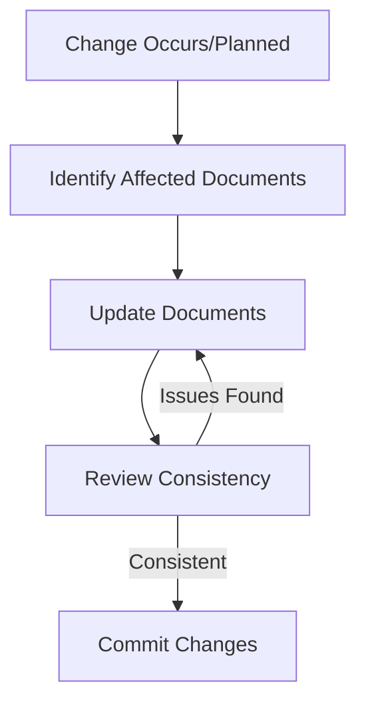

# Context Network Maintenance Guide

## Purpose
This document establishes the principles and practices for maintaining the context network as a complete, accurate, and current representation of the PackFS project's understanding and state.

## Classification
- **Domain:** Meta
- **Stability:** Stable
- **Abstraction:** Procedural
- **Confidence:** Critical

## Core Principle

**The context network is the authoritative source of truth for all project knowledge, decisions, and state.**

Every aspect of the project—from high-level vision to implementation details—must be accurately reflected in the context network. This is not optional documentation; it is the project's living knowledge base.

## Maintenance Requirements

### 1. Synchronization Rules

#### Code Changes → Context Network
- **Before Implementation**: Document planned changes in relevant documents
- **During Implementation**: Update architecture and technical documents
- **After Implementation**: Ensure all changes are reflected in:
  - Component maps
  - Implementation details
  - API documentation
  - Test documentation

#### Context Network → Code
- **Design First**: Major features should be designed in context network before coding
- **ADRs Before Changes**: Significant decisions require ADRs before implementation
- **Roadmap Alignment**: Code changes must align with documented roadmap

### 2. Document Categories and Update Triggers

#### Foundation Documents
**Update When:**
- Project vision or mission changes
- Major scope changes occur
- Success criteria are modified
- Core principles evolve

**Documents:**
- `project_definition.md`
- `principles.md`
- `system_overview.md`

#### Architecture Documents
**Update When:**
- New components are added
- Component responsibilities change
- Integration patterns evolve
- Technical architecture shifts

**Documents:**
- `component_map.md`
- `implementation_details.md`
- Integration patterns
- Data flow documentation

#### Decision Documents
**Update When:**
- Architectural decisions are made
- Technology choices change
- Process decisions occur
- Previous decisions are superseded

**Documents:**
- New ADRs
- `decision_index.md`
- Related architecture documents

#### Planning Documents
**Update When:**
- Milestones are completed
- Timelines change
- Priorities shift
- New features are planned

**Documents:**
- `roadmap.md`
- `milestones.md`
- Sprint planning documents

#### Process Documents
**Update When:**
- Development workflows change
- Build processes evolve
- Testing strategies update
- New tools are adopted

**Documents:**
- `development_workflow.md`
- `creation.md`
- `delivery.md`
- `validation.md`

### 3. Update Workflow

### 4. Consistency Checks

#### Cross-Document Consistency
- Component names must match across all documents
- Version numbers must be synchronized
- Dates must be accurate and consistent
- Technical details must align

#### Code-Document Consistency
- API signatures in docs must match implementation
- Configuration examples must be valid
- Import paths must be correct
- Build commands must work

### 5. Update Patterns

#### Immediate Updates Required
- **Security issues**: Document immediately upon discovery
- **Breaking changes**: Update before merging code
- **API changes**: Update interface documentation
- **Configuration changes**: Update examples and guides

#### Batch Updates Acceptable
- **Minor refactoring**: Can be batched weekly
- **Documentation improvements**: Can be batched
- **Non-critical process changes**: Can be batched

### 6. Quality Standards

#### Every Document Must Have
- Accurate metadata (dates, authors)
- Clear relationships to other documents
- Proper classification
- Change history

#### Technical Documents Must Include
- Code examples that compile/run
- Accurate type definitions
- Valid configuration examples
- Working command examples

### 7. Verification Checklist

Before any significant commit:

- [ ] Are all code changes reflected in architecture docs?
- [ ] Are new decisions documented in ADRs?
- [ ] Is the roadmap still accurate?
- [ ] Are API examples up to date?
- [ ] Do build commands still work?
- [ ] Are component relationships accurate?
- [ ] Is the change history updated?

### 8. Living Documentation Practices

#### Regular Reviews
- **Weekly**: Quick consistency check
- **Monthly**: Comprehensive review
- **Quarterly**: Strategic alignment review

#### Proactive Updates
- Document decisions as they're made
- Update architecture before implementation
- Capture lessons learned immediately
- Document workarounds and gotchas

#### Documentation Debt
- Track documentation debt like technical debt
- Prioritize updates that block understanding
- Allocate time for documentation maintenance
- Consider documentation completeness in "done" criteria

## Anti-Patterns to Avoid

### ❌ Documentation Drift
Allowing code and documentation to diverge

### ❌ Retroactive Documentation
Waiting until "later" to document changes

### ❌ Orphaned Documents
Creating documents without proper relationships

### ❌ Stale Examples
Keeping non-working code examples

### ❌ Missing Context
Documenting what without why

### ❌ Inconsistent Terminology
Using different terms for the same concept

## Automation Opportunities

### Consider Automating
- Link checking between documents
- Code example validation
- Metadata freshness checks
- Cross-reference validation
- Build command testing

## Emergency Procedures

### When Documentation is Out of Sync

1. **Stop new development** until sync is restored
2. **Audit all recent changes** to identify gaps
3. **Update critical paths first** (security, API, build)
4. **Review and verify** all updates
5. **Post-mortem** to prevent recurrence

## Success Metrics

### The Context Network is Successful When
- New team members can onboard using only the context network
- All project decisions can be traced to documentation
- No surprises exist between docs and code
- The network accurately represents current state
- Future plans are clearly documented

## Relationships
- **Parent Nodes:** [meta/maintenance.md]
- **Child Nodes:** None
- **Related Nodes:** 
  - All documents in the context network
  - [meta/updates.md] - guides - Update procedures
  - [processes/document_integration.md] - implements - Integration practices

## Navigation Guidance
- **Access Context:** Reference this whenever updating any part of the project
- **Common Next Steps:** Use verification checklist before commits
- **Related Tasks:** Code review, documentation review, planning
- **Update Patterns:** This document should rarely change; it represents core principles

## Metadata
- **Created:** 2024-01-18
- **Last Updated:** 2024-01-18
- **Updated By:** Implementation team

## Change History
- 2024-01-18: Initial creation establishing context network as source of truth