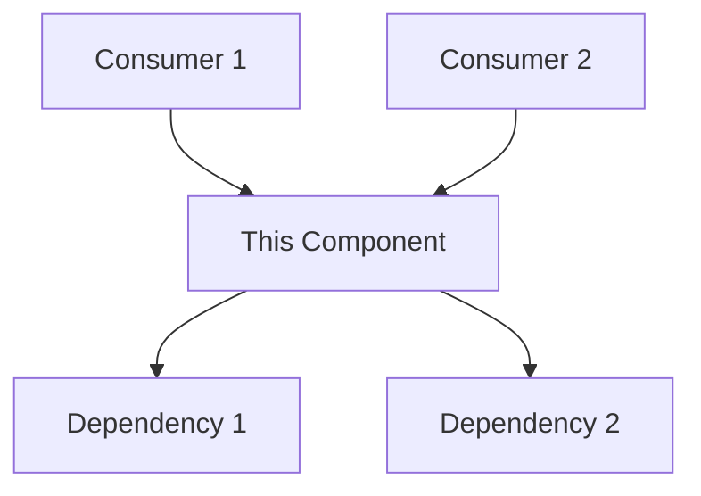
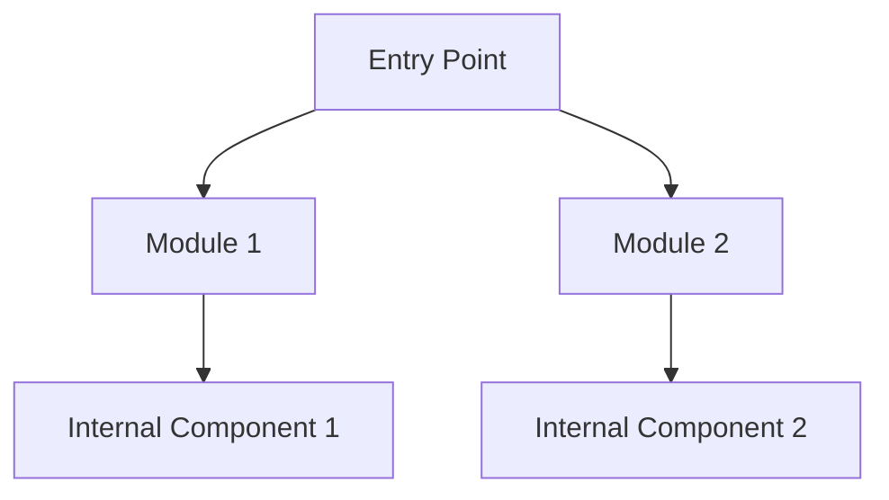

# Component: [NAME]

## Purpose
This document describes the [Name] component, its responsibilities, interfaces, and implementation details.

## Classification
- **Domain:** Architecture
- **Stability:** [Static/Semi-stable/Dynamic]
- **Abstraction:** [Conceptual/Structural/Detailed]
- **Confidence:** [Established/Evolving/Speculative]
- **Lifecycle Stage:** [Planning/Active/Legacy/Deprecated/Archived]

## Content

### Component Overview

[Single sentence describing why this component exists]



### Responsibilities

#### Primary Responsibilities
- [What this component is responsible for]
- [What this component is responsible for]
- [What this component is responsible for]

#### Non-Responsibilities
- [What this component is explicitly NOT responsible for]
- [What this component is explicitly NOT responsible for]

### Interface

#### Public API
[Public API/contract this component exposes]

```typescript
// Example interface definition
interface ComponentAPI {
  method1(param: Type): ReturnType;
  method2(param: Type): ReturnType;
  // ...
}
```

#### Events
[Events this component emits or consumes]

| Event | Direction | Purpose |
|-------|-----------|---------|
| [Event Name] | [Emitted/Consumed] | [Purpose] |
| [Event Name] | [Emitted/Consumed] | [Purpose] |

#### Configuration
[Configuration options this component accepts]

| Option | Type | Default | Description |
|--------|------|---------|-------------|
| [Option] | [Type] | [Default] | [Description] |
| [Option] | [Type] | [Default] | [Description] |

### Dependencies

#### Required Dependencies
- **[Dependency Name]**: [What this component needs from the dependency]
- **[Dependency Name]**: [What this component needs from the dependency]

#### Optional Dependencies
- **[Dependency Name]**: [What this component can use if available]
- **[Dependency Name]**: [What this component can use if available]

#### Consumers
- **[Consumer Name]**: [How the consumer uses this component]
- **[Consumer Name]**: [How the consumer uses this component]

### Implementation Details

#### Internal Structure
[Description of the internal structure of the component]



#### Key Algorithms
[Description of key algorithms used in the component]

#### Data Structures
[Description of key data structures used in the component]

#### State Management
[Description of how state is managed within the component]

### Operational Characteristics

#### Performance Expectations
- [Performance expectation 1]
- [Performance expectation 2]

#### Resource Requirements
- [Resource requirement 1]
- [Resource requirement 2]

#### Failure Modes
- [Failure mode 1]: [How it fails and recovery strategy]
- [Failure mode 2]: [How it fails and recovery strategy]

#### Monitoring and Observability
- [Key metrics to monitor]
- [Logging approach]
- [Tracing integration]

### Testing Strategy
[Approach to testing this component]

### Security Considerations
[Security aspects of this component]

### Key Design Decisions
[Links to relevant ADRs and rationale]

- [ADR-XXX]: [Brief description of the decision]
- [ADR-YYY]: [Brief description of the decision]

### Evolution Notes
[How this component might need to change in the future]

## Relationships
- **Parent Nodes:** [architecture/component_map.md]
- **Child Nodes:** 
  - [Child component 1] - [relationship type] - [brief description]
  - [Child component 2] - [relationship type] - [brief description]
- **Related Nodes:** 
  - [Related component or decision] - [relationship type] - [brief description]
  - [Related component or decision] - [relationship type] - [brief description]

## Navigation Guidance
- **Access Context:** Use this document when needing to understand the [Component Name], its responsibilities, and interfaces
- **Common Next Steps:** After reviewing this component, typically explore [related components or decisions]
- **Related Tasks:** [Development tasks, testing tasks, integration tasks]
- **Update Patterns:** This document should be updated when the component's interface, responsibilities, or implementation significantly changes

## Metadata
- **Created:** [Date]
- **Last Updated:** [Date]
- **Updated By:** [Role/Agent]
- **Primary Maintainers:** [Team or individuals responsible]

## Change History
- [Date]: [Change description]
