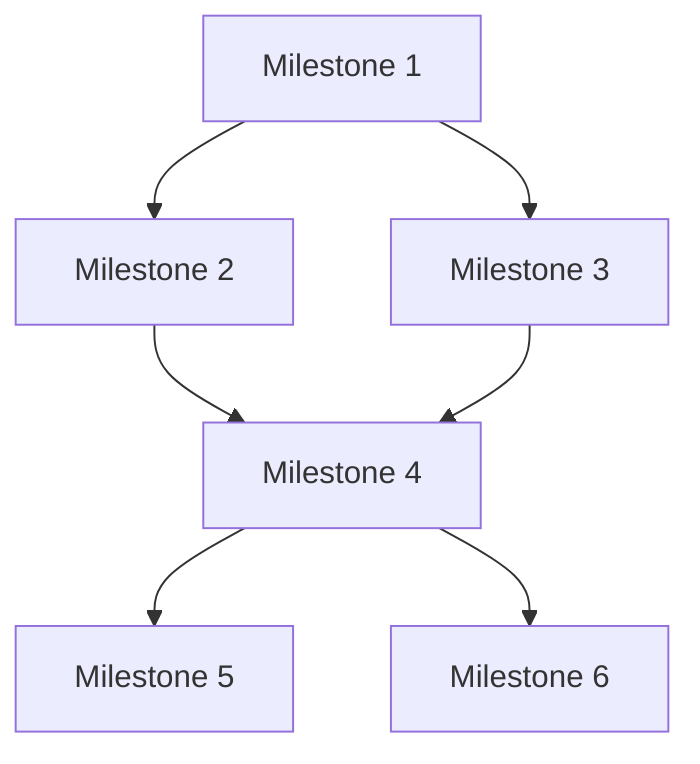

# Project Milestones

## Purpose
This document provides detailed information about project milestones, including acceptance criteria, dependencies, and tracking.

## Classification
- **Domain:** Planning
- **Stability:** Dynamic
- **Abstraction:** Detailed
- **Confidence:** Evolving

## Content

### Milestone Overview

[Provide a high-level overview of the project milestones and their relationships]

### Milestone Details

#### Milestone 1: [Milestone 1 Name]

- **Target Date:** [Date]
- **Status:** [Not Started/In Progress/Completed]
- **Owner:** [Name or Role]
- **Description:** [Detailed description of the milestone]

**Objectives:**
- [Objective 1]
- [Objective 2]
- [Objective 3]

**Deliverables:**
- [Deliverable 1]
- [Deliverable 2]
- [Deliverable 3]

**Acceptance Criteria:**
- [Criterion 1]
- [Criterion 2]
- [Criterion 3]

**Dependencies:**
- **Incoming:** [Dependencies that this milestone relies on]
- **Outgoing:** [Dependencies that rely on this milestone]

**Resources Required:**
- [Resource 1]
- [Resource 2]
- [Resource 3]

**Risks:**
- [Risk 1]
- [Risk 2]
- [Risk 3]

**Progress Tracking:**
- [Key metric 1]: [Status]
- [Key metric 2]: [Status]
- [Key metric 3]: [Status]

#### Milestone 2: [Milestone 2 Name]

- **Target Date:** [Date]
- **Status:** [Not Started/In Progress/Completed]
- **Owner:** [Name or Role]
- **Description:** [Detailed description of the milestone]

**Objectives:**
- [Objective 1]
- [Objective 2]
- [Objective 3]

**Deliverables:**
- [Deliverable 1]
- [Deliverable 2]
- [Deliverable 3]

**Acceptance Criteria:**
- [Criterion 1]
- [Criterion 2]
- [Criterion 3]

**Dependencies:**
- **Incoming:** [Dependencies that this milestone relies on]
- **Outgoing:** [Dependencies that rely on this milestone]

**Resources Required:**
- [Resource 1]
- [Resource 2]
- [Resource 3]

**Risks:**
- [Risk 1]
- [Risk 2]
- [Risk 3]

**Progress Tracking:**
- [Key metric 1]: [Status]
- [Key metric 2]: [Status]
- [Key metric 3]: [Status]

### Milestone Tracking

| Milestone | Target Date | Status | % Complete | Owner | Key Blockers |
|-----------|------------|--------|------------|-------|--------------|
| [Milestone 1] | [Date] | [Status] | [%] | [Owner] | [Blockers] |
| [Milestone 2] | [Date] | [Status] | [%] | [Owner] | [Blockers] |
| [Milestone 3] | [Date] | [Status] | [%] | [Owner] | [Blockers] |
| [Milestone 4] | [Date] | [Status] | [%] | [Owner] | [Blockers] |
| [Milestone 5] | [Date] | [Status] | [%] | [Owner] | [Blockers] |
| [Milestone 6] | [Date] | [Status] | [%] | [Owner] | [Blockers] |

### Milestone Review Process

[Describe the process for reviewing milestone completion and approving progression to the next milestone]

### Milestone Adjustment Process

[Describe the process for adjusting milestone targets, scope, or timelines if needed]

## Relationships
- **Parent Nodes:** [planning/roadmap.md]
- **Child Nodes:** None
- **Related Nodes:** 
  - [foundation/project_definition.md] - derives-from - Milestones implement project goals
  - [processes/creation.md] - executes - Creation processes work toward milestones

## Navigation Guidance
- **Access Context:** Use this document when planning work, tracking progress, or evaluating milestone completion
- **Common Next Steps:** After reviewing milestones, typically explore specific deliverables or dependencies
- **Related Tasks:** Sprint planning, progress reporting, resource allocation
- **Update Patterns:** This document should be updated bi-weekly or when milestone status changes

## Metadata
- **Created:** [Date]
- **Last Updated:** [Date]
- **Updated By:** [Role/Agent]

## Change History
- [Date]: Initial creation of milestones template
