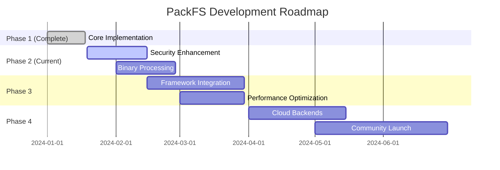

# Project Roadmap

## Purpose
This document outlines the planned development path for PackFS, including key milestones, features, and timelines.

## Classification
- **Domain:** Planning
- **Stability:** Dynamic
- **Abstraction:** Structural
- **Confidence:** Evolving

## Content

### Roadmap Overview

PackFS development follows a phased approach, starting with core functionality and expanding to advanced features and integrations. The project has successfully completed its MVP phase and is now positioned for enhancement and community adoption.

### Current Phase

**Phase: Phase 2 - Enhancement and Security**
**Status: In Progress**

Building upon the MVP foundation, Phase 2 focuses on hardening security features, adding binary file support, and completing the framework integrations. This phase transforms the proof-of-concept into a production-ready library.

### Completed Milestones

#### MVP Implementation (Phase 1) ✅
- **Completed Date:** 2024-01-18
- **Status:** Completed
- **Description:** Core package structure with basic functionality
- **Key Deliverables:**
  - ✅ TypeScript project setup with dual module support
  - ✅ Core filesystem interface and types
  - ✅ Memory and Disk backends
  - ✅ Basic security engine and path validation
  - ✅ Text processor and semantic chunker
  - ✅ Framework integration stubs (LangChain, AutoGPT, CrewAI)
  - ✅ Jest test suite with 20 passing tests
  - ✅ Build system producing ESM/CJS/Types

### Upcoming Milestones

#### Advanced Security Features
- **Target Date:** 2024-02-15
- **Status:** In Progress
- **Description:** Complete security implementation with advanced features
- **Key Deliverables:**
  - Virtual filesystem support
  - Advanced permission system
  - Audit logging
  - Rate limiting for operations
  - Encrypted storage option
- **Dependencies:**
  - Core security engine (completed)
  - Path validator (completed)

#### Binary File Processing
- **Target Date:** 2024-02-28
- **Status:** Not Started
- **Description:** Support for binary files with content extraction
- **Key Deliverables:**
  - Apache Tika integration
  - Support for 1000+ file formats
  - Binary content summarization
  - Metadata extraction
  - Preview generation
- **Dependencies:**
  - Processor framework (completed)
  - Content chunking system (completed)

#### Complete Framework Integrations
- **Target Date:** 2024-03-30
- **Status:** Not Started
- **Description:** Full implementation of framework adapters
- **Key Deliverables:**
  - LangChain tool with full filesystem operations
  - AutoGPT plugin with command system
  - CrewAI tool with agent coordination
  - **Mastra native integration with tool factory (Priority: High)**
  - Semantic Kernel adapter
  - Integration tests for each framework
  - Documentation and examples
- **Dependencies:**
  - Core filesystem interface (completed)
  - Security system (in progress)

#### Mastra Native Integration (High Priority)
- **Target Date:** 2024-07-15
- **Status:** Specification Ready
- **Description:** Native Mastra framework integration with tool factory
- **Key Deliverables:**
  - `createPackfsTools()` function for generating Mastra-compatible tools
  - Intent-based API (AccessIntent, DiscoverIntent, UpdateIntent)
  - Pre-built Zod schemas for all operations
  - Built-in security validation at tool level
  - Semantic content processing for structured documents
  - Configuration-based tool generation
  - Integration tests and documentation
  - Migration guide from custom wrapper patterns
- **Dependencies:**
  - Core filesystem interface (completed)
  - Security system (in progress)
  - Semantic chunker (completed)
- **Expected Benefits:**
  - 90% reduction in integration boilerplate code
  - Consistent security patterns across Mastra projects
  - Improved developer experience

### Feature Timeline

#### Phase 2: Security and Enhancement
- **Timeline:** January 19 - February 28, 2024
- **Theme:** Production readiness and advanced features
- **Features:**
  - Virtual Filesystem: Isolated filesystem environments - **Priority: High**
  - Permission System: Fine-grained access control - **Priority: High**
  - Binary Processing: Support for non-text files - **Priority: High**
  - Audit Logging: Track all filesystem operations - **Priority: Medium**
  - Encryption: At-rest encryption for sensitive data - **Priority: Medium**
  - Compression: Automatic compression for storage - **Priority: Low**

#### Phase 3: Integration and Performance
- **Timeline:** March 1 - March 30, 2024
- **Theme:** Framework ecosystem and optimization
- **Features:**
  - LangChain Integration: Complete tool implementation - **Priority: High**
  - AutoGPT Integration: Full plugin system - **Priority: High**
  - CrewAI Integration: Multi-agent support - **Priority: High**
  - **Mastra Native Integration: Tool factory with intent-based API - Priority: High**
  - Streaming API: Large file streaming - **Priority: High**
  - Caching System: Three-tier cache architecture - **Priority: Medium**
  - Batch Operations: Bulk file operations - **Priority: Medium**

#### Phase 4: Cloud and Community
- **Timeline:** April 1 - June 30, 2024
- **Theme:** Cloud support and ecosystem growth
- **Features:**
  - AWS S3 Backend: Full S3 compatibility - **Priority: High**
  - Azure Blob Backend: Azure storage support - **Priority: High**
  - Google Cloud Backend: GCS integration - **Priority: Medium**
  - Plugin System: Extensibility framework - **Priority: Medium**
  - CLI Tool: Command-line interface - **Priority: Low**
  - Web Dashboard: Monitoring interface - **Priority: Low**

### Release Strategy

**Version Strategy:**
- **0.1.x**: MVP and basic features (current)
- **0.2.x**: Security enhancements and binary support
- **0.3.x**: Complete framework integrations
- **0.4.x**: Performance optimizations
- **0.5.x**: Cloud backend support
- **1.0.0**: Production-ready release with stable API

**Release Frequency:**
- Minor versions: Monthly
- Patch versions: As needed for bug fixes
- Major version: When API stability achieved

### Resource Allocation

**Current Focus:**
- 50% - Security enhancements
- 30% - Binary processing implementation
- 20% - Documentation and testing

**Next Phase:**
- 60% - Framework integrations
- 30% - Performance optimization
- 10% - Community support

### Risk Assessment

| Risk | Impact | Likelihood | Mitigation Strategy |
|------|--------|------------|---------------------|
| Framework API Changes | High | Medium | Maintain compatibility layers, version pinning |
| Performance Bottlenecks | High | Medium | Early performance testing, profiling tools |
| Security Vulnerabilities | High | Low | Security audits, penetration testing |
| Community Adoption | Medium | Medium | Clear documentation, integration examples |
| Scope Creep | Medium | High | Strict phase boundaries, feature prioritization |
| Dependency Issues | Low | Medium | Minimal dependencies, regular updates |

### Roadmap Review Process

**Review Schedule:**
- Monthly progress reviews
- Quarterly roadmap adjustments
- Community feedback integration

**Review Criteria:**
- Feature completion status
- Community feedback and requests
- Security audit results
- Performance benchmarks
- Framework ecosystem changes

## Relationships
- **Parent Nodes:** [foundation/project_definition.md]
- **Child Nodes:** [planning/milestones.md]
- **Related Nodes:** 
  - [architecture/component_map.md] - implements - Components support roadmap features
  - [architecture/implementation_details.md] - details - Technical implementation of features

## Navigation Guidance
- **Access Context:** Use this document when planning work, prioritizing features, or communicating timelines
- **Common Next Steps:** After reviewing the roadmap, explore specific milestone details or implementation plans
- **Related Tasks:** Sprint planning, resource allocation, stakeholder communication
- **Update Patterns:** This document should be updated monthly or when significant changes to the plan occur

## Metadata
- **Created:** Initial project planning
- **Last Updated:** 2024-06-19
- **Updated By:** Development team

## Change History
- Initial: Created roadmap template
- 2024-01-18: Updated with current progress, completed Phase 1, adjusted timelines
- 2024-06-19: Added Mastra native integration milestone and features based on user feedback