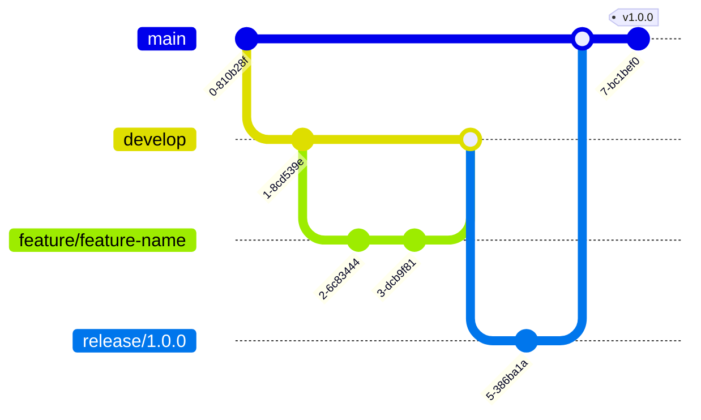

# Creation Process

## Purpose
This document outlines the creation process for the project, including workflows, standards, and best practices.

## Classification
- **Domain:** Process
- **Stability:** Semi-stable
- **Abstraction:** Structural
- **Confidence:** Established

## Content

### Creation Workflow

[Provide a high-level overview of the creation workflow]


### Work Environments

#### Local Work Environment

[Describe the setup and configuration of the local work environment]

**Prerequisites:**
- [Prerequisite 1]
- [Prerequisite 2]
- [Prerequisite 3]

**Setup Instructions:**
1. [Step 1]
2. [Step 2]
3. [Step 3]

**Working Locally:**
```
[Instructions for working in the local environment]
```

#### Collaborative Environment

[Describe the shared collaborative environment]

**Access:**
[Instructions for accessing the collaborative environment]

**Usage Guidelines:**
[Guidelines for using the collaborative environment]

#### Validation Environment

[Describe the validation environment]

**Access:**
[Instructions for accessing the validation environment]

**Usage Guidelines:**
[Guidelines for using the validation environment]

#### Pre-release Environment

[Describe the pre-release environment]

**Access:**
[Instructions for accessing the pre-release environment]

**Usage Guidelines:**
[Guidelines for using the pre-release environment]

#### Release Environment

[Describe the release environment]

**Access:**
[Instructions for accessing the release environment]

**Usage Guidelines:**
[Guidelines for using the release environment]

### Creation Process Steps

#### 1. Planning

**Activities:**
- [Activity 1]
- [Activity 2]
- [Activity 3]

**Outputs:**
- [Output 1]
- [Output 2]
- [Output 3]

**Tools:**
- [Tool 1]
- [Tool 2]
- [Tool 3]

#### 2. Creation

**Activities:**
- [Activity 1]
- [Activity 2]
- [Activity 3]

**Outputs:**
- [Output 1]
- [Output 2]
- [Output 3]

**Tools:**
- [Tool 1]
- [Tool 2]
- [Tool 3]

#### 3. Review

**Activities:**
- [Activity 1]
- [Activity 2]
- [Activity 3]

**Outputs:**
- [Output 1]
- [Output 2]
- [Output 3]

**Tools:**
- [Tool 1]
- [Tool 2]
- [Tool 3]

#### 4. Validation

**Activities:**
- [Activity 1]
- [Activity 2]
- [Activity 3]

**Outputs:**
- [Output 1]
- [Output 2]
- [Output 3]

**Tools:**
- [Tool 1]
- [Tool 2]
- [Tool 3]

#### 5. Integration

**Activities:**
- [Activity 1]
- [Activity 2]
- [Activity 3]

**Outputs:**
- [Output 1]
- [Output 2]
- [Output 3]

**Tools:**
- [Tool 1]
- [Tool 2]
- [Tool 3]

#### 6. Delivery

**Activities:**
- [Activity 1]
- [Activity 2]
- [Activity 3]

**Outputs:**
- [Output 1]
- [Output 2]
- [Output 3]

**Tools:**
- [Tool 1]
- [Tool 2]
- [Tool 3]

#### 7. Feedback

**Activities:**
- [Activity 1]
- [Activity 2]
- [Activity 3]

**Outputs:**
- [Output 1]
- [Output 2]
- [Output 3]

**Tools:**
- [Tool 1]
- [Tool 2]
- [Tool 3]

### Quality Standards

[Describe the quality standards for the project]

#### General Guidelines

- [Guideline 1]
- [Guideline 2]
- [Guideline 3]

#### Domain-Specific Guidelines

**[Domain 1]:**
- [Guideline 1]
- [Guideline 2]
- [Guideline 3]

**[Domain 2]:**
- [Guideline 1]
- [Guideline 2]
- [Guideline 3]

### Version Control

#### Versioning Strategy

[Describe the versioning strategy for the project]



#### Change Tracking Guidelines

[Describe the guidelines for tracking changes]

#### Review Process

[Describe the process for reviewing and approving changes]

### Validation Strategy

[Describe the validation strategy for the project]

#### Unit Validation

[Describe the approach to validating individual units of work]

#### Integration Validation

[Describe the approach to validating integrated components]

#### Comprehensive Validation

[Describe the approach to comprehensive validation]

#### Performance Validation

[Describe the approach to performance validation]

### Documentation

[Describe the documentation requirements and processes]

#### Work Documentation

[Describe the requirements for documenting the work]

#### Interface Documentation

[Describe the requirements for documenting interfaces]

#### User Documentation

[Describe the requirements for user documentation]

### Continuous Integration/Continuous Delivery

[Describe the CI/CD pipeline for the project]


## Relationships
- **Parent Nodes:** [foundation/principles.md]
- **Child Nodes:** 
  - [processes/validation.md]
  - [processes/delivery.md]
- **Related Nodes:** 
  - [planning/roadmap.md] - implements - Creation process implements roadmap items
  - [foundation/structure.md] - follows - Creation follows structural guidelines

## Navigation Guidance
- **Access Context:** Use this document when onboarding new team members or when needing to understand or follow the creation process
- **Common Next Steps:** After reviewing the creation process, typically explore specific aspects like validation or delivery
- **Related Tasks:** Element creation, issue resolution, review, validation
- **Update Patterns:** This document should be updated when creation processes change or are refined

## Metadata
- **Created:** [Date]
- **Last Updated:** [Date]
- **Updated By:** [Role/Agent]

## Change History
- [Date]: Initial creation of creation process document
