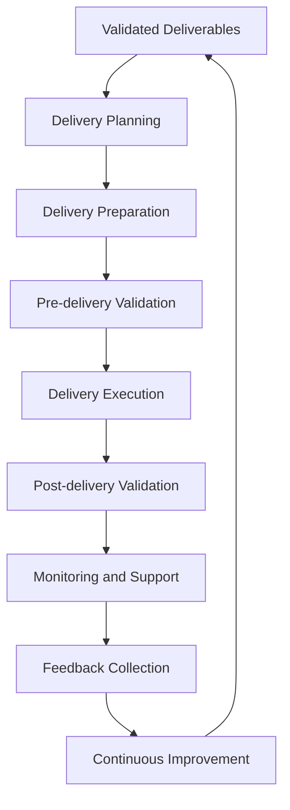

# Delivery Process

## Purpose
This document outlines the delivery process for the project, including strategies, methods, and best practices.

## Classification
- **Domain:** Process
- **Stability:** Semi-stable
- **Abstraction:** Structural
- **Confidence:** Established

## Content

### Delivery Overview

[Provide a high-level overview of the delivery approach for the project]

### Delivery Principles

[Describe the key principles that guide the delivery approach]

1. **[Principle 1]**
   [Description of Principle 1]

2. **[Principle 2]**
   [Description of Principle 2]

3. **[Principle 3]**
   [Description of Principle 3]

### Delivery Environments

#### Staging Environment

**Purpose:**
[Describe the purpose of the staging environment]

**Configuration:**
[Describe the configuration of the staging environment]

**Access:**
[Instructions for accessing the staging environment]

**Usage Guidelines:**
[Guidelines for using the staging environment]

#### Production Environment

**Purpose:**
[Describe the purpose of the production environment]

**Configuration:**
[Describe the configuration of the production environment]

**Access:**
[Instructions for accessing the production environment]

**Usage Guidelines:**
[Guidelines for using the production environment]

### Delivery Process Steps

#### 1. Delivery Planning

**Activities:**
- [Activity 1]
- [Activity 2]
- [Activity 3]

**Outputs:**
- [Output 1]
- [Output 2]
- [Output 3]

**Tools:**
- [Tool 1]
- [Tool 2]
- [Tool 3]

#### 2. Delivery Preparation

**Activities:**
- [Activity 1]
- [Activity 2]
- [Activity 3]

**Outputs:**
- [Output 1]
- [Output 2]
- [Output 3]

**Tools:**
- [Tool 1]
- [Tool 2]
- [Tool 3]

#### 3. Pre-delivery Validation

**Activities:**
- [Activity 1]
- [Activity 2]
- [Activity 3]

**Outputs:**
- [Output 1]
- [Output 2]
- [Output 3]

**Tools:**
- [Tool 1]
- [Tool 2]
- [Tool 3]

#### 4. Delivery Execution

**Activities:**
- [Activity 1]
- [Activity 2]
- [Activity 3]

**Outputs:**
- [Output 1]
- [Output 2]
- [Output 3]

**Tools:**
- [Tool 1]
- [Tool 2]
- [Tool 3]

#### 5. Post-delivery Validation

**Activities:**
- [Activity 1]
- [Activity 2]
- [Activity 3]

**Outputs:**
- [Output 1]
- [Output 2]
- [Output 3]

**Tools:**
- [Tool 1]
- [Tool 2]
- [Tool 3]

#### 6. Monitoring and Support

**Activities:**
- [Activity 1]
- [Activity 2]
- [Activity 3]

**Outputs:**
- [Output 1]
- [Output 2]
- [Output 3]

**Tools:**
- [Tool 1]
- [Tool 2]
- [Tool 3]

#### 7. Feedback Collection

**Activities:**
- [Activity 1]
- [Activity 2]
- [Activity 3]

**Outputs:**
- [Output 1]
- [Output 2]
- [Output 3]

**Tools:**
- [Tool 1]
- [Tool 2]
- [Tool 3]

#### 8. Continuous Improvement

**Activities:**
- [Activity 1]
- [Activity 2]
- [Activity 3]

**Outputs:**
- [Output 1]
- [Output 2]
- [Output 3]

**Tools:**
- [Tool 1]
- [Tool 2]
- [Tool 3]

### Delivery Strategies

#### Phased Delivery

**Description:**
[Describe the phased delivery strategy]

**When to Use:**
[Describe when to use phased delivery]

**Process:**
1. [Step 1]
2. [Step 2]
3. [Step 3]

**Benefits:**
- [Benefit 1]
- [Benefit 2]
- [Benefit 3]

**Challenges:**
- [Challenge 1]
- [Challenge 2]
- [Challenge 3]

#### Full Delivery

**Description:**
[Describe the full delivery strategy]

**When to Use:**
[Describe when to use full delivery]

**Process:**
1. [Step 1]
2. [Step 2]
3. [Step 3]

**Benefits:**
- [Benefit 1]
- [Benefit 2]
- [Benefit 3]

**Challenges:**
- [Challenge 1]
- [Challenge 2]
- [Challenge 3]

#### Canary Delivery

**Description:**
[Describe the canary delivery strategy]

**When to Use:**
[Describe when to use canary delivery]

**Process:**
1. [Step 1]
2. [Step 2]
3. [Step 3]

**Benefits:**
- [Benefit 1]
- [Benefit 2]
- [Benefit 3]

**Challenges:**
- [Challenge 1]
- [Challenge 2]
- [Challenge 3]

### Delivery Automation

[Describe the approach to delivery automation]

#### Continuous Delivery Pipeline

[Describe the continuous delivery pipeline]

**Components:**
- [Component 1]
- [Component 2]
- [Component 3]

**Setup:**
[Instructions for setting up the continuous delivery pipeline]

**Usage:**
[Guidelines for using the continuous delivery pipeline]

### Rollback Procedures

[Describe the procedures for rolling back a delivery if issues are encountered]

#### Rollback Triggers

[Describe the triggers that would initiate a rollback]

#### Rollback Process

1. [Step 1]
2. [Step 2]
3. [Step 3]

#### Rollback Testing

[Describe how rollback procedures are tested]

### Delivery Documentation

[Describe the documentation requirements for delivery]

#### Delivery Plans

[Describe the requirements for delivery plans]

#### Release Notes

[Describe the requirements for release notes]

#### Delivery Reports

[Describe the requirements for delivery reports]

### Compliance and Governance

[Describe any compliance and governance requirements related to delivery]

#### Regulatory Requirements

[Describe any regulatory requirements that must be met]

#### Approval Processes

[Describe any approval processes that must be followed]

#### Audit Trails

[Describe the requirements for maintaining audit trails]

## Relationships
- **Parent Nodes:** [processes/validation.md]
- **Child Nodes:** None
- **Related Nodes:** 
  - [processes/creation.md] - precedes - Creation precedes delivery
  - [foundation/principles.md] - guided-by - Delivery follows project principles
  - [foundation/structure.md] - delivers - Delivery implements the project structure

## Navigation Guidance
- **Access Context:** Use this document when planning or executing delivery activities
- **Common Next Steps:** After reviewing delivery processes, typically explore specific delivery strategies or tools
- **Related Tasks:** Delivery planning, delivery execution, monitoring, feedback collection
- **Update Patterns:** This document should be updated when delivery processes change or are refined

## Metadata
- **Created:** 5/16/2025
- **Last Updated:** 5/16/2025
- **Updated By:** Context Network Update

## Change History
- 5/16/2025: Created from deployment.md template with more generic terminology
