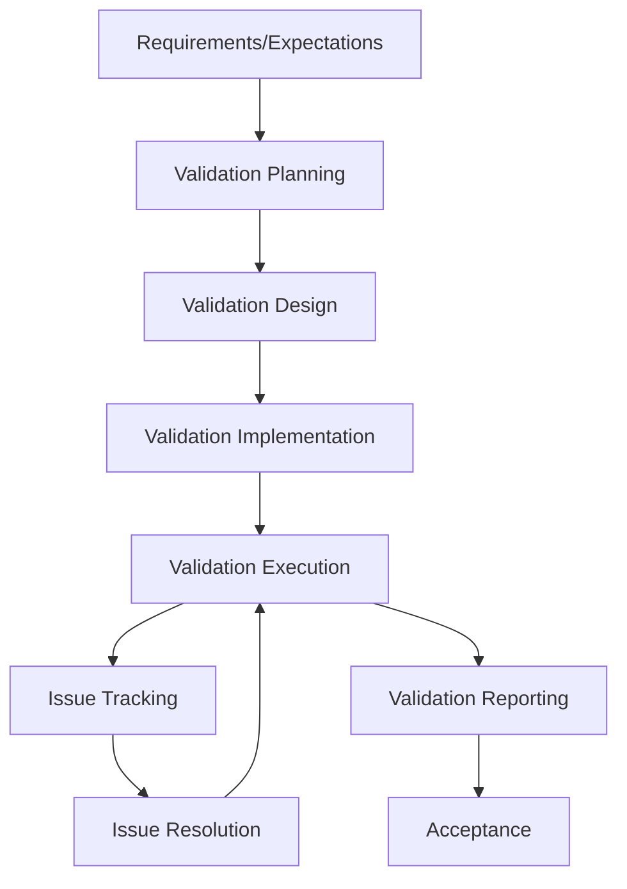

# Validation Process

## Purpose
This document outlines the validation process for the project, including strategies, methods, and best practices.

## Classification
- **Domain:** Process
- **Stability:** Semi-stable
- **Abstraction:** Structural
- **Confidence:** Established

## Content

### Validation Overview

[Provide a high-level overview of the validation approach for the project]

### Validation Principles

[Describe the key principles that guide the validation approach]

1. **[Principle 1]**
   [Description of Principle 1]

2. **[Principle 2]**
   [Description of Principle 2]

3. **[Principle 3]**
   [Description of Principle 3]

### Validation Types

#### Unit Validation

**Purpose:**
[Describe the purpose of unit validation]

**Scope:**
[Describe what is included in unit validation]

**Responsibility:**
[Describe who is responsible for unit validation]

**Process:**
1. [Step 1]
2. [Step 2]
3. [Step 3]

**Tools:**
- [Tool 1]
- [Tool 2]
- [Tool 3]

#### Integration Validation

**Purpose:**
[Describe the purpose of integration validation]

**Scope:**
[Describe what is included in integration validation]

**Responsibility:**
[Describe who is responsible for integration validation]

**Process:**
1. [Step 1]
2. [Step 2]
3. [Step 3]

**Tools:**
- [Tool 1]
- [Tool 2]
- [Tool 3]

#### System Validation

**Purpose:**
[Describe the purpose of system validation]

**Scope:**
[Describe what is included in system validation]

**Responsibility:**
[Describe who is responsible for system validation]

**Process:**
1. [Step 1]
2. [Step 2]
3. [Step 3]

**Tools:**
- [Tool 1]
- [Tool 2]
- [Tool 3]

#### Acceptance Validation

**Purpose:**
[Describe the purpose of acceptance validation]

**Scope:**
[Describe what is included in acceptance validation]

**Responsibility:**
[Describe who is responsible for acceptance validation]

**Process:**
1. [Step 1]
2. [Step 2]
3. [Step 3]

**Tools:**
- [Tool 1]
- [Tool 2]
- [Tool 3]

### Validation Environments

#### Local Validation Environment

[Describe the local validation environment]

**Setup:**
[Instructions for setting up the local validation environment]

**Usage:**
[Guidelines for using the local validation environment]

#### Shared Validation Environment

[Describe the shared validation environment]

**Access:**
[Instructions for accessing the shared validation environment]

**Usage:**
[Guidelines for using the shared validation environment]

#### Production-like Validation Environment

[Describe the production-like validation environment]

**Access:**
[Instructions for accessing the production-like validation environment]

**Usage:**
[Guidelines for using the production-like validation environment]

### Validation Process

#### 1. Validation Planning

**Activities:**
- [Activity 1]
- [Activity 2]
- [Activity 3]

**Outputs:**
- [Output 1]
- [Output 2]
- [Output 3]

**Tools:**
- [Tool 1]
- [Tool 2]
- [Tool 3]

#### 2. Validation Design

**Activities:**
- [Activity 1]
- [Activity 2]
- [Activity 3]

**Outputs:**
- [Output 1]
- [Output 2]
- [Output 3]

**Tools:**
- [Tool 1]
- [Tool 2]
- [Tool 3]

#### 3. Validation Implementation

**Activities:**
- [Activity 1]
- [Activity 2]
- [Activity 3]

**Outputs:**
- [Output 1]
- [Output 2]
- [Output 3]

**Tools:**
- [Tool 1]
- [Tool 2]
- [Tool 3]

#### 4. Validation Execution

**Activities:**
- [Activity 1]
- [Activity 2]
- [Activity 3]

**Outputs:**
- [Output 1]
- [Output 2]
- [Output 3]

**Tools:**
- [Tool 1]
- [Tool 2]
- [Tool 3]

#### 5. Issue Tracking

**Activities:**
- [Activity 1]
- [Activity 2]
- [Activity 3]

**Outputs:**
- [Output 1]
- [Output 2]
- [Output 3]

**Tools:**
- [Tool 1]
- [Tool 2]
- [Tool 3]

#### 6. Issue Resolution

**Activities:**
- [Activity 1]
- [Activity 2]
- [Activity 3]

**Outputs:**
- [Output 1]
- [Output 2]
- [Output 3]

**Tools:**
- [Tool 1]
- [Tool 2]
- [Tool 3]

#### 7. Validation Reporting

**Activities:**
- [Activity 1]
- [Activity 2]
- [Activity 3]

**Outputs:**
- [Output 1]
- [Output 2]
- [Output 3]

**Tools:**
- [Tool 1]
- [Tool 2]
- [Tool 3]

### Validation Strategies

#### Functional Validation

[Describe the approach to functional validation]

**Techniques:**
- [Technique 1]
- [Technique 2]
- [Technique 3]

**Best Practices:**
- [Best Practice 1]
- [Best Practice 2]
- [Best Practice 3]

#### Performance Validation

[Describe the approach to performance validation]

**Techniques:**
- [Technique 1]
- [Technique 2]
- [Technique 3]

**Best Practices:**
- [Best Practice 1]
- [Best Practice 2]
- [Best Practice 3]

#### Security Validation

[Describe the approach to security validation]

**Techniques:**
- [Technique 1]
- [Technique 2]
- [Technique 3]

**Best Practices:**
- [Best Practice 1]
- [Best Practice 2]
- [Best Practice 3]

#### Usability Validation

[Describe the approach to usability validation]

**Techniques:**
- [Technique 1]
- [Technique 2]
- [Technique 3]

**Best Practices:**
- [Best Practice 1]
- [Best Practice 2]
- [Best Practice 3]

### Validation Automation

[Describe the approach to validation automation]

#### Automated Validation Framework

[Describe the automated validation framework]

**Components:**
- [Component 1]
- [Component 2]
- [Component 3]

**Setup:**
[Instructions for setting up the automated validation framework]

**Usage:**
[Guidelines for using the automated validation framework]

#### Continuous Validation

[Describe the continuous validation approach]

**Integration with CI/CD:**
[Describe how validation is integrated with CI/CD]

**Validation Gates:**
[Describe the validation gates in the CI/CD pipeline]

### Validation Metrics

[Describe the metrics used to measure validation effectiveness]

#### Coverage Metrics

- [Metric 1]
- [Metric 2]
- [Metric 3]

#### Quality Metrics

- [Metric 1]
- [Metric 2]
- [Metric 3]

#### Efficiency Metrics

- [Metric 1]
- [Metric 2]
- [Metric 3]

### Validation Documentation

[Describe the documentation requirements for validation]

#### Validation Plans

[Describe the requirements for validation plans]

#### Validation Cases

[Describe the requirements for validation cases]

#### Validation Reports

[Describe the requirements for validation reports]

## Relationships
- **Parent Nodes:** [processes/creation.md]
- **Child Nodes:** None
- **Related Nodes:** 
  - [processes/delivery.md] - follows - Delivery follows validation
  - [foundation/principles.md] - guided-by - Validation follows project principles
  - [foundation/structure.md] - validates - Validation ensures structure is implemented correctly

## Navigation Guidance
- **Access Context:** Use this document when planning or performing validation activities
- **Common Next Steps:** After reviewing validation processes, typically explore specific validation strategies or tools
- **Related Tasks:** Validation planning, validation execution, issue resolution, validation reporting
- **Update Patterns:** This document should be updated when validation processes change or are refined

## Metadata
- **Created:** [Date]
- **Last Updated:** [Date]
- **Updated By:** [Role/Agent]

## Change History
- [Date]: Initial creation of validation process document
